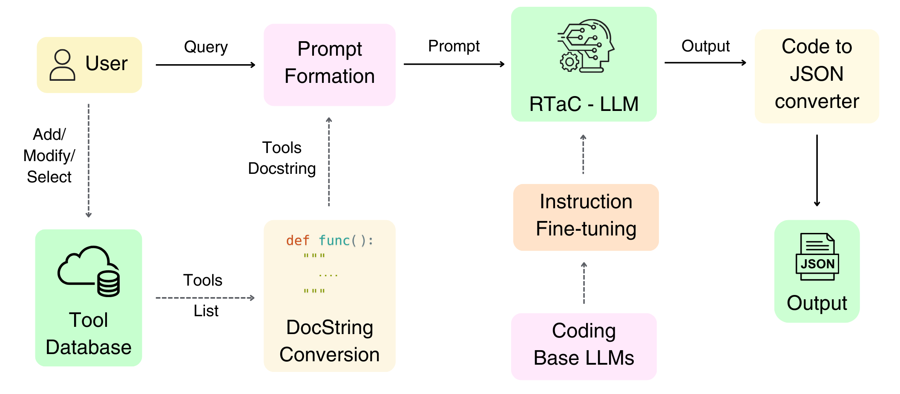
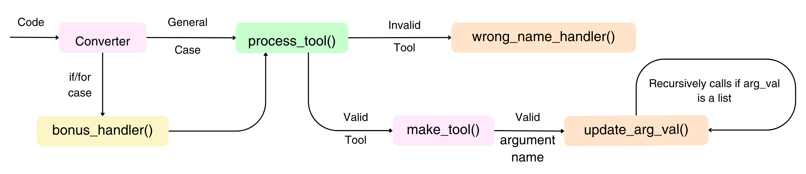
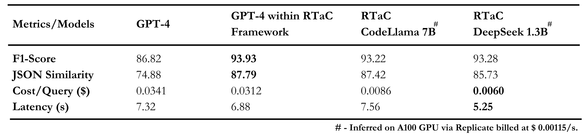

# **DevRev High Prep: Reimagining Tooling as Coding(RTaC)**

This repository contains our solution for the ‘AI Agent 007: Tooling up for success’ problem statement, provided by DevRev as a part of Inter-IIT Tech 12.0.

<br>
<p align="center">
  
</p>

<div align="center">
  

  <h3 align="center">Figure 1: Our proposed pipeline - RTaC</h3> </div>


<br>
We present RTaC, which reconceptualizes the task of tooling as a coding task to exploit the powerful code-comprehension capabilities of LLMs. RTaC provides tools to be used in docstring format to instruction-finetuned Coding-Base LLMs, extracts output in Python code format, and then deterministically converts it to JSON. RTaC promotes docstring reading capability in the LLMs and hence supports tool modification, addition and deletion. Using RTaC, we achieve GPT-4 benchmark performance while employing just DeepSeek 1.3B and CodeLLama 7B LLMs, despite a drastic reduction in parameter count by over 300 times. Cost reduction per query by over five times is achieved while matching GPT-4’s latency. Moreover, RTaC supports the processing of complex conditional and iterative logic (Bonus), surpassing GPT-4's capabilities.

<br>
<br>

**The application has been deployed for convenience and can be accessed [here](https://devrev-interiit-team13.netlify.app).**

<details>

  <summary><h3>Table of Contents</h3></summary>

- [1. Getting Started](#getting-started)
  -  [1.1 Pre-requisites](#pre-requisites)
  -  [1.2 Quick start](#quick-start)
- [2. Build from scratch](#build-from-scratch)
  -  [2.1 Dependencies](#dependencies)
  -  [2.2 Dataset Generation](#dataset-generation)
  -  [2.3 Downloading Models](#downloading-models)
  -  [2.4 Fine-tuning](#fine-tuning)
  -  [2.5 JSON Converter](#json-converter)
  -  [2.6 Inference and Evaluation](#inference-and-evaluation)

</details>

# Getting Started - Running Application Locally

## Pre-requisites
> [!NOTE]
> Ensure the following dependencies are installed on your system:


#### Docker and Docker Compose

- [Download Docker Desktop for Windows, Mac, or Linux](https://www.docker.com/products/docker-desktop).


#### Python 3.0 or Later

- [Download the latest version of Python](https://www.python.org/downloads/).

#### Node Package Manager (npm)

-  [Install Node.js and npm](https://nodejs.org/).


## Quick start
### Using Git

1. **Clone the Repository**
   ```bash
   git clone https://github.com/devrev-high/Final_Code
   cd ./website/frontend
   ```
2. **Install Frontend Dependencies**
   ```bash
   npm install
   ```
3. **Configure Environment**
   - Create a `.env` file based on `.env.example`.

4. **Start the Server**
   ```bash
   npm run dev
   ```

### Using Docker

1. **Navigate to backend directory**
   ```bash
   cd ./website/backend
   ```
3. **Build the Docker Image**
   ```bash
   docker-compose build
   ```
4. **Run the Docker Image**
   ```bash
   docker-compose up
   ```
<br>

In case, you are unable to run the deployed website or run the website locally, an interactive playground notebook can also be accessed [here](executables/play_ground.ipynb). 

**Note:** This supports only limited functionality, and is meant for backup purposes only.

<br>

# Build from Scratch

Change directory to RTaC by running the following command:
```bash
cd ./RTaC
```

## Dependencies

Run the below command to install all dependencies automatically:
```bash
conda env create -f environment_droplet.yml
```


## Dataset Generation
The dataset can be generated from scratch by running the [dataset_main](RTaC/executables/dataset_main.ipynb) notebook in the `notebooks` folder. The notebook creates a `generated` directory within the `datasets` folder and saves the generated datasets in the required format in that directory. The exact method and prompt formations have been outlined in detail in the notebook itself. 

For our experiments, all our datasets were evaluated by a human, often involving corrections due to errors incurred during the generation stage. We have provided the pre-generated datasets in the `datasets/pre-generated` folder. We strongly encourage training models on the pre-generated dataset.

#### Data Generation Process:

To maintain credibility and verifiability, we generate data for three different scenarios mentioned in the report:

1. Evaluating Few-Shot prompting of CodeLLMs **(referred to as P1)** (check section 4.2.1 of the report)
2. Training and Evaluating CodeLLMs for the tool-memorisation methodology **(referred to as P2)** (check section 4.2.2 of the report)
3. Training and Evaluating RTaC (our proposed final pipeline) **(referred to as P3)** (check section 4.2.3 of the report)

We adopt the Self-instruct methodology to generate our datasets, which utilizes GPT-4 to generate queries and outputs, encompassing the tool list passed to it in the prompt. Further, we split the task of query and output generation between two distinct LLM agents to tackle the vulnerability of LLMs to hallucinations.

## Downloading Models

Our best RTaC models can be downloaded locally using the following command:

```bash
gdown https://drive.google.com/drive/folders/1lpJCVKcnz93K_dvhZa51hVijid-IuwNr?usp=sharing --folder --remaining-ok
```

## Fine Tuning

### Description

Any open-sourced LLM can be fine-tuned using the `fine_Tuning.py` script provided in the src directory. The script can be used to train on both locally stored datasets and open-sourced datasets hosted on Hugging Face. It is built to cover both the scenarios of training - P2 and P3, simply by changing the dataset that the model is being trained on.

### Usage:

Below is a template command to initiate fine-tuning using the `fine_Tuning.py` script. 

```bash
python executables/finetuning.py --pipeline <pipeline_version> --repo_dir <finetuning_mode> --dataset_1 <stage_1_dataset_name> --dataset_2 <stage_2_dataset_name> --base_model <model_name> --n_1 <num_epochs_stage_1> --n_2 <num_epochs_stage_2> --lora_alpha_1 <lora_alpha_value_stage_1> --lora_alpha_2 <lora_alpha_value_stage_2> --lora_dropout_1 <lora_dropout_value_stage_1> --lora_dropout_2 <lora_dropout_value_stage_2> --lora_r_1 <lora_r_value_stage_1> --lora_r_2 <lora_r_value_stage_2> --learning_rate_1 <learning_rate_stage_1> --learning_rate_2 <learning_rate_stage_2>
```

To train under the P2 (tool-memorization) scenario, run the following command:

```bash
python executables/fine_Tuning.py --pipeline 2 --repo_dir 2 --dataset_1 datasets/Pre-Generated/P2_datasets/train_val --base_model codellama/CodeLlama-7b-Instruct-hf
```

To train under the P3 (RTaC) scenario, run the following command:

```bash
python executables/fine_Tuning.py --pipeline 3 --repo_dir 2 --dataset_1 datasets/Pre-Generated/P3_datasets/train_val/Stage-1 --dataset_2 datasets/Pre-Generated/P3_datasets/train_val/Stage-2 --base_model codellama/CodeLlama-7b-Instruct-hf

```

For a detailed explanation of each argument, refer to the subsequent table:

| Option             | Description                                             | Type    | Default                                           |
|--------------------|---------------------------------------------------------|---------|---------------------------------------------------|
| `--pipeline`       | Enter 2 for p2, 3 for p3                                | int     | 3                                                 |
| `--repo_dir`       | Enter 1 for hf repo, 2 for local dir                    | int     | 2                                                 |
| `--dataset_1`      | Name of stage 1 dataset to finetune                     | str     | "datasets/Pre-Generated/P3_datasets/train_val/Stage-1" |
| `--dataset_2`      | Name of stage 2 dataset to finetune                     | str     | "datasets/Pre-Generated/P3_datasets/train_val/Stage-2" |
| `--base_model`     | Name of base model to finetune                          | str     | "RtaC-Models/codellama/CodeLlama-7b-Instruct-hf"               |
| `--n_1`            | Number of stage 1 epochs                                | int     | 5                                                 |
| `--n_2`            | Number of stage 2 epochs                                | int     | 5                                                 |
| `--lora_alpha_1`   | Alpha parameter value for stage 1 LoRA                  | int     | 16                                                |
| `--lora_alpha_2`   | Alpha parameter value for stage 2 LoRA                  | int     | 16                                                |
| `--lora_dropout_1` | Dropout parameter value for stage 1 LoRA                | float   | 0.1                                               |
| `--lora_dropout_2` | Dropout parameter value for stage 2 LoRA                | float   | 0.1                                               |
| `--lora_r_1`       | R parameter value for stage 1 LoRA                      | int     | 8                                                 |
| `--lora_r_2`       | R parameter value for stage 2 LoRA                      | int     | 8                                                 |
| `--learning_rate_1`| Value of learning rate for stage 1                      | float   | 2e-4                                              |
| `--learning_rate_2`| Value of learning rate for stage 2                      | float   | 2e-4                                              |
<br>

## JSON Converter


<p align="center">
  
</p>

<div align="center">
  

  <h3 align="center">Figure 2: Code-to-JSON Converter</h3> </div>

  <br>
The model outputs are generated in a Python-inspired format. A Code-to-JSON converter was built to convert the Python outputs to the desirable JSON format. The working of the converter has been briefly explained below:
<br>

1. To convert the model’s generated code to the required JSON format, we use a Python script. This file is modelled as a compiler-type script and is a key component of our pipeline.

2. Each line is individually classified into either a bonus (if/for) case or a general case. The bonus cases go through their respective handlers and are then treated like the general case.

3. The typical flow of any case involves the following calls: `process_tool` calls `make_tool` for each valid `tool_name`, `make_tool` calls `update_arg_val` for each valid argument name.

For a more detailed explanation of how the converter works, please refer to section A.1 of the report.

<be>

## Inference and Evaluation

Inference and Evaluation can be carried out by running the [inference_main](RTaC/executables/inference_main.ipynb) notebook in the `notebooks` folder. This notebook creates an `output` directory and stores the generated outputs as CSV files.

### Inference

The inference is independently conducted for all three scenarios: P1, P2 and P3. Each of these scenarios is evaluated on three types of test datasets: Static, Dynamic and Bonus. Our trained models have been uploaded on HuggingFace. The inference and evaluation notebook directly loads the models from HuggingFace.

#### Usage
- For each scenario (P1, P2, and P3), run the respective inference code blocks for Static, Dynamic, and Bonus datasets.
- The outputs are saved in separate CSV files for each dataset type.

### Evaluation

#### Description
This section evaluates the performance of each pipeline on the three test datasets. Evaluation is done using the following metrics:

- Precision
- Recall
- F1 Score
- [LangChain Metric](https://api.python.langchain.com/en/latest/evaluation/langchain.evaluation.parsing.json_distance.JsonEditDistanceEvaluator.html#)

#### Usage
- For each scenario (P1, P2, and P3), run the respective evaluation code blocks for Static, Dynamic, and Bonus datasets.
- The evaluation scores are printed as output in the notebook itself.

A sample result from our original set of experiments is shown below:

<br>
<p align="center">
  
</p>

<div align="center">
  

  <h3 align="center">Figure 3: Evaluation Result</h3> </div> <be>
